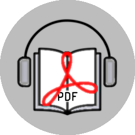

<!-- LOGO  -->


<!-- INTRODUCTION -->
# PDF to Speech Converter


A Python script that converts PDF files to speech (MP3) using Google Cloud Text-to-Speech API, effectively creating audiobooks from text documents.

<!-- TABLE OF CONTENTS -->
<details>
  <summary>Table of Contents</summary>
  <ol>
    <li><a href="#PDF-to-Speech-Converter">PDF to Speech Converter</a></li>
    <li><a href="#Features">Features</a></li>
    <li>
      <a href="#installation">Installation</a>
      <ul>
        <li><a href="#prerequisites">Prerequisites</a></li>
        <li><a href="#steps">Steps</a></li>
        <li><a href="#Setup-Google-Cloud-Text-to-Speech-API">Setup Google Cloud Text-to-Speech API</a></li>
      </ul>
    </li>
    <li><a href="#user-guide">User Guide</a></li>
    <li><a href="#project-structure">Project Structure</a></li>
    <li><a href="#configuration">Configuration</a></li>
    <li><a href="#example">Example</a></li>
    <li><a href="#future-enhancements">Future Enhancements</a></li>
    <li>
        <a href="#contributing">Contributing</a>
      <ul>
        <li><a href="#fork-the-repository">Fork the repository</a></li>
      </ul>
    </li>
    <li><a href="#license">License</a></li>
    <li><a href="#acknowledgements">Acknowledgements</a></li>
  </ol>
</details>

<!-- FEATURES -->
## Features

- Extract text from PDF files
- Convert text to natural-sounding speech
- Output as MP3 audio files
- Handle large PDFs by splitting text into manageable chunks
- Customizable voice options (language, gender)

<!-- INSTALLATION -->
## Installation

### Prerequisites

- Python 3.7+
- Google Cloud account (free tier available)
- VS Code (recommended) or any Python IDE

### Steps

1. Clone the repository:
```bash
git clone https://github.com/garschke/pdf-to-speech.git
cd pdf-to-speech
```

2. Create and activate a virtual environment:
```bash
python -m venv venv           # Windows
.\venv\Scripts\activate       # Windows

python3 -m venv .venv         # Mac/Linux
source .venv/bin/activate     # Mac/Linux
```

3. Install dependencies:
```bash
pip3 install -r requirements.txt
```

### Setup Google Cloud Text-to-Speech API

1. Go to [Google Cloud Console](https://console.cloud.google.com/)
2. Create a new project
3. Enable the Text-to-Speech API
4. Create a service account and download the JSON key file
5. Save the key file in the project folder as `google_credentials.json`

<!-- USER GUIDE -->
## User Guide

Run the script with:
```bash
python pdf_to_speech.py     # Windows
python3 pdf_to_speech.py    # Mac/Linux
```

When prompted:
1. Enter the path to your PDF file
2. Enter the desired output MP3 filename (default: output.mp3)

The script will:
1. Extract text from the PDF
2. Convert the text to speech using Google's API
3. Save the audio as an MP3 file


<!-- PROJECT STRUCTURE -->
## Project Structure

```
pdf-to-speech/
├── pdf_to_speech.py        # Main conversion script
├── google_credentials.json # Google Cloud credentials
├── requirements.txt        # Dependencies
├── .gitignore              # Files to ignore in version control
└── README.md               # This file
```

<!-- CONFIGURATION -->
## Configuration

You can modify these aspects in the code:
- Voice parameters (language, gender, specific voice model)
- Audio format (currently MP3)
- Text chunk size (default 5000 characters per API request)

<!-- EXAMPLE -->
## Example

```bash
python pdf_to_speech.py
Enter the path to your PDF file: sample.pdf
Enter the output MP3 file name (default: output.mp3): my_audiobook.mp3
```

<!-- FUTURE ENHANCEMENTS -->
## Future Enhancements

1. 🔲  -  **Progress Tracking**: Add a progress bar for large PDFs
2. 🔲  - **SSML Support**: Implement Speech Synthesis Markup Language for better pronunciation
3. 🔲  - **GUI**: Create a simple Flask web interface or Tkinter desktop app
4. 🔲  - **Configuration**: Allow users to select different voices and languages


<!-- CONTRIBUTING -->
## Contributing
Contributions are welcome! Please open an issue or submit a pull request for any improvements.

### Fork the repository
1. Create your feature branch: git checkout -b feature/NewFeature
2. Commit your changes: git commit -m 'Add new feature'
3. Push to the branch: git push origin feature/NewFeature
4. Open a pull request.


<!-- LICENCE -->
## License

This project is licensed under the MIT License - see the [LICENSE](LICENSE) file for details.

<!-- AKNOWLEDGEMENTS -->
## Acknowledgments

- [Google Cloud](https://cloud.google.com/text-to-speech/docs?_gl) Text-to-Speech API
- [PyPDF2](https://pypi.org/project/PyPDF2/) library for PDF text extraction
- Python community for excellent tooling